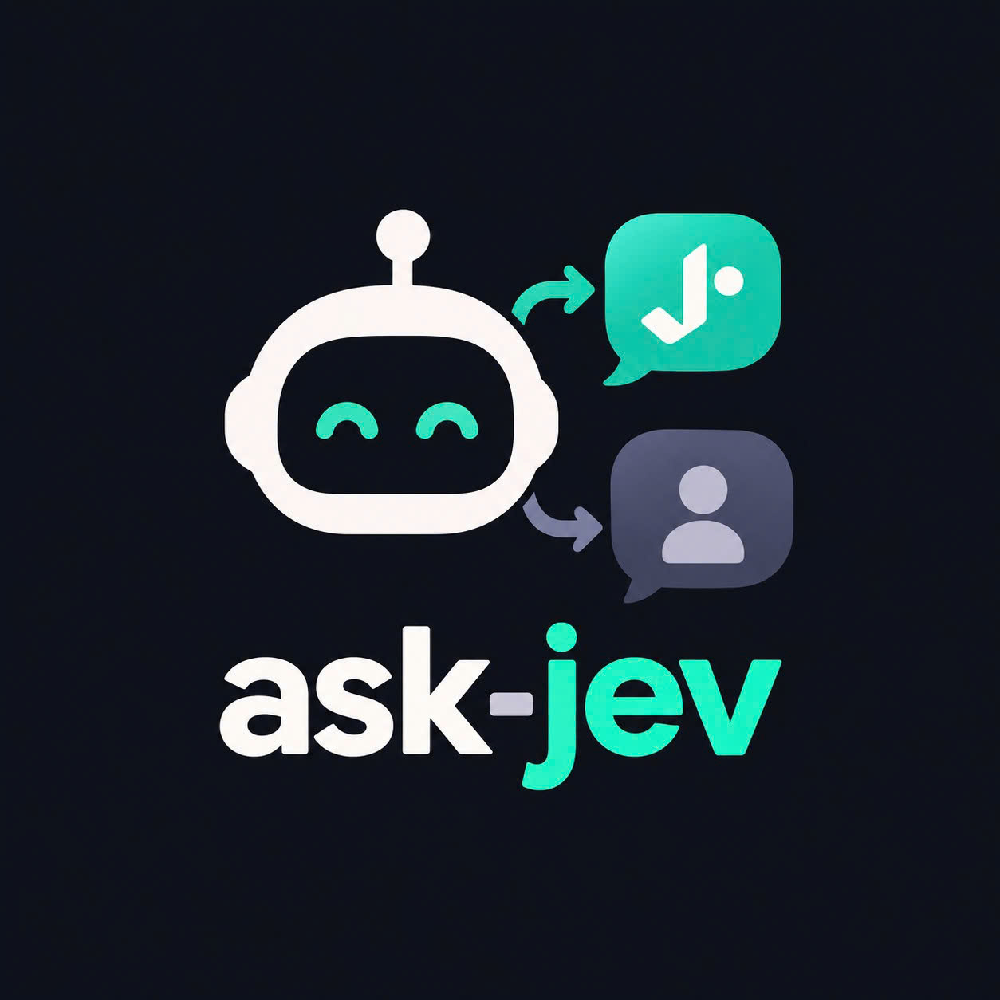

<p align="center"></p>

<h1 align="center">ask-jev</h1>

<p align="center">
  
  
  
  
</p>

<p align="center"><a href="./README.md">English</a> · <strong>Tiếng Việt</strong></p>

Hỏi [Jev](https://typesafe.ai) trước khi hỏi bạn.

Claude Code dừng lại hỏi bạn (`AskUserQuestion`) cả những câu mà đáp án đã nằm
sẵn trong cuộc hội thoại. Plugin này chặn câu hỏi đó lại, đưa cho Jev — một model
đánh giá trả về xác suất thay vì chữ — và tự trả lời khi đáp án suy ra được.

Câu nào thuộc về bạn thì vẫn tới bạn.

```
"Dùng thư viện nào để parse ngày?"     → tự chọn date-fns (1.00)   — đã có trong package.json
"Đóng gói thành plugin hay skill?"     → tự chọn Plugin  (0.95)
"Bạn muốn giao diện tông màu nào?"     → hỏi bạn                   — sở thích
"Có xoá luôn 3 environment cũ không?"  → hỏi bạn                   — không hoàn tác được
```

## Cài

```
/plugin marketplace add yanmad27/ask-jev
/plugin install ask-jev@ask-jev
```

Rồi đặt khoá Vercel AI Gateway (có Jev trong danh mục model):

```bash
echo 'vck_...' > ~/.claude/ask-jev.key && chmod 600 ~/.claude/ask-jev.key
```

Hoặc dùng biến môi trường `AI_GATEWAY_API_KEY` nếu bạn đã có sẵn.

Không khoá = plugin nằm im, Claude Code hỏi bạn như thường.

## Nó quyết thế nào

Mỗi câu hỏi là **một** request Jev với **hai** câu hỏi:

- `pick` — phương án nào đúng, kèm phân phối xác suất
- `personal` — *câu hỏi này có được phép tự quyết không*

Câu thứ hai mới là phần quan trọng. Thiếu nó, Jev sẽ tự tin chọn giúp bạn cả
tông màu thương hiệu lẫn việc xoá thư mục — sai không phải về sự thật mà về
thẩm quyền. `personal` chặn sở thích, đánh đổi phụ thuộc mục tiêu riêng, và mọi
việc không hoàn tác được, kể cả khi `pick` rất chắc.

Để `pick` có ý nghĩa, mỗi lựa chọn phải có description **định nghĩa** nó — đó
mới là tiêu chí Jev chấm, chứ không phải cái nhãn. Câu "Đây có phải burger
không?" với lựa chọn chỉ ghi "Có" thì Jev chẳng có gì để chấm cả; "Có" cần một
description như "Một món ăn nóng: miếng thịt bằm nướng kẹp trong bánh mì tròn
cắt đôi". Thiếu description ở bất kỳ lựa chọn nào, Claude Code không gọi Jev —
câu hỏi bị trả ngược cho Claude kèm hướng dẫn hỏi lại với đầy đủ định nghĩa.
Vòng đó không có gì đến tay bạn.

Bên dưới, mỗi lựa chọn được gửi dạng `{what, not_for}` — `not_for` nêu tên
các lựa chọn anh em mà nó không được trùng, để các định nghĩa loại trừ nhau
chứ không chỉ đứng cạnh nhau.

## Khi nào nó im lặng

| Điều kiện | Vì sao |
|---|---|
| `personal > 0.5` | quyền của bạn, không phải của model |
| độ chắc `< JEV_ASK_THRESHOLD` | đoán mò thì thà hỏi |
| câu hỏi `multiSelect` | một lựa chọn sai kéo theo cả chùm |
| nhiều câu mà chỉ chắc vài câu | trả lời nửa chừng vẫn phải hỏi lại, mà bạn đã mất một lựa chọn |
| có lựa chọn thiếu description | nhãn trần không phải tiêu chí — trả về cho Claude hỏi lại, không đưa cho Jev |
| không khoá / Jev lỗi / quá 8s | hỏng thì không được chặn bạn trả lời |

## Cấu hình

| Biến | Mặc định | |
|---|---|---|
| `AI_GATEWAY_API_KEY` | `~/.claude/ask-jev.key` | khoá Vercel AI Gateway |
| `JEV_ASK_THRESHOLD` | `0.8` | hạ xuống = tự quyết nhiều hơn, sai nhiều hơn |
| `JEV_MODEL` | `typesafe-ai/jev` | |
| `JEV_GATEWAY_URL` | endpoint đánh giá của Vercel | |

File khoá cũ `~/.claude/jev-ask.key` (trước khi đổi tên) vẫn được đọc như phương án dự phòng.

## Tự hỏi Jev

Skill `skills/ask-jev` + CLI `bin/jev.mjs` cho Claude tự hỏi Jev với bất kỳ
quyết định nào, không chỉ `AskUserQuestion` — phân loại, chọn phương án,
có/không, chấm điểm. Skill định nghĩa thế nào là một request tốt: bằng chứng
dán nguyên vào `state`, mỗi câu hỏi một quyết định, tiêu chí quan sát được và
loại trừ lẫn nhau. CLI chỉ việc gửi nó:

```
echo '{"state": ..., "questions": ...}' | node "${CLAUDE_PLUGIN_ROOT}/bin/jev.mjs"
```

Chi tiết request và ví dụ: `skills/ask-jev/SKILL.md`.

## Sửa plugin

Máy đang phát triển thì trỏ marketplace vào thư mục làm việc thay vì GitHub, để
sửa xong là chạy luôn, không phải push rồi update:

```
/plugin marketplace add ~/workspace/ask-jev
```

## Ghi chú kỹ thuật

Không phụ thuộc npm — chỉ `fetch` và `fs` của Node. Gọi thẳng endpoint đánh giá
của gateway nên không cần `npm install`, không có `node_modules`, cài là chạy.

Claude Code không cho hook trả về tool result giả. Nhưng `PreToolUse` với
`permissionDecision: "deny"` thì `permissionDecisionReason` **được đưa ngược vào
model** — nên "trả lời thay bạn" ở đây thực chất là *chặn câu hỏi + nói cho model
biết đáp án*. Trong phiên bạn sẽ thấy một dòng `Jev answered: ...` rồi model đi tiếp.

Claude Code hiện không chạy `PreToolUse` hook khai trong plugin
([anthropics/claude-code#36397](https://github.com/anthropics/claude-code/issues/36397))
— chỉ `SessionStart` từ plugin là chạy được. Nên `hooks/self-register.mjs` chạy
mỗi `SessionStart`, tự ghi entry `PreToolUse` thẳng vào `~/.claude/settings.json`
của bạn — nơi hook vẫn chạy bình thường — và tự cập nhật lại đường dẫn mỗi khi
plugin lên bản mới. Nó chỉ đụng đúng entry của mình, phần còn lại của
`settings.json` giữ nguyên. Khi nào upstream sửa xong thì entry này thừa nhưng
vô hại — tốn nhiều lắm là thêm một lần gọi gateway.

Ngữ cảnh lấy từ 12 lượt gần nhất của transcript phiên (bỏ lượt subagent và lượt
máy sinh), cắt còn 6000 ký tự. Khoảng $0.00002 và ~0.7s mỗi câu hỏi.
